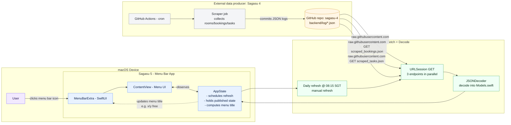
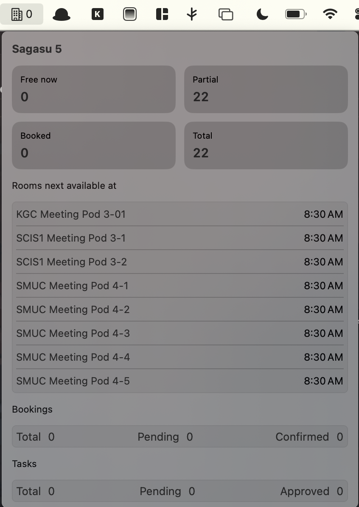
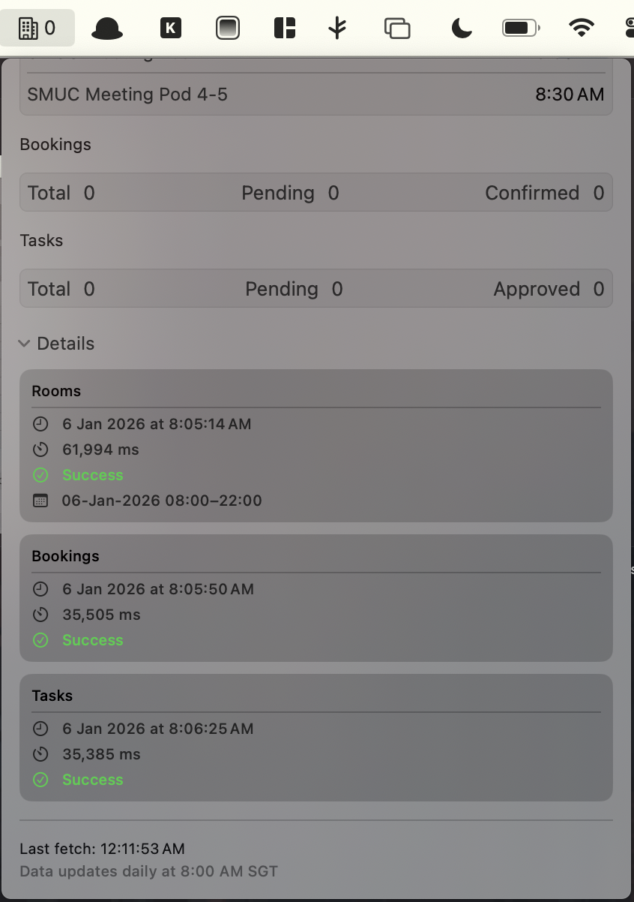

[](https://github.com/gongahkia/sagasu-5/releases/tag/5.0.0)


# `Sagasu 5`

<p align="center">
    
</p>

Run [it](#other-notes) back *(but as a [MacOS](https://www.apple.com/os/macos/) menu bar app)*.

## Stack

* *Frontend*: [SwiftUI](https://developer.apple.com/swiftui/)
* *Backend*: [Swift](https://developer.apple.com/swift/)
* *API*: [`Sagasu 4`'s data](#data)

## Rationale

See [this](https://github.com/gongahkia/sagasu#rationale), [this](https://github.com/gongahkia/sagasu-2#rationale), [this](https://github.com/gongahkia/sagasu-3#rationale) and [this](https://github.com/gongahkia/sagasu-4#rationale).

## Architecture



## Screenshots

<div align="center">
    
    
</div>

## Usage

Note that `Sagasu 5` *(like `Sagasu 4`)* was primarily made for my own use. The most immediate and easiest way for others to access `Sagasu 5` is via [direct download](https://support.apple.com/en-us/102662) of the `Sagasu.dmg` [here]().

If you are interested in cloning and building `Sagasu 5` yourself, the below instructions are for you.

1. First execute the below to install the repository on your local machine.

```console
$ git clone https://github.com/gongahkia/sagasu-5 && cd sagasu-5
```

2. Next install Xcode from the [Mac App Store](https://apps.apple.com/us/app/xcode/id497799835?mt=12).

3. Finally run the below command to build the project with [Xcode](https://developer.apple.com/xcode/) via the [Xcode CLI toolkit](https://mac.install.guide/commandlinetools/).

```console
$ swift build
```

4. Alternatively open the project directly within Xcode and build it via the [GUI view](https://developer.apple.com/documentation/xcode/building-and-running-an-app).

## Data

For those interested, `Sagasu 5` is currenly configured to pull daily data from `Sagasu 4`'s below [publicly available endpoints](https://github.com/gongahkia/sagasu-4).

* `backend/log/scraped_log.json`
* `backend/log/scraped_bookings.json`
* `backend/log/scraped_tasks.json`

## Other notes

`Sagasu 5` is where it is today because of the below projects. 

* [Sagasu](https://github.com/gongahkia/sagasu)
* [Sagasu 2](https://github.com/gongahkia/sagasu-2)
* [Sagasu 3](https://github.com/gongahkia/sagasu-3)
* [Sagasu 4](https://github.com/gongahkia/sagasu-4)