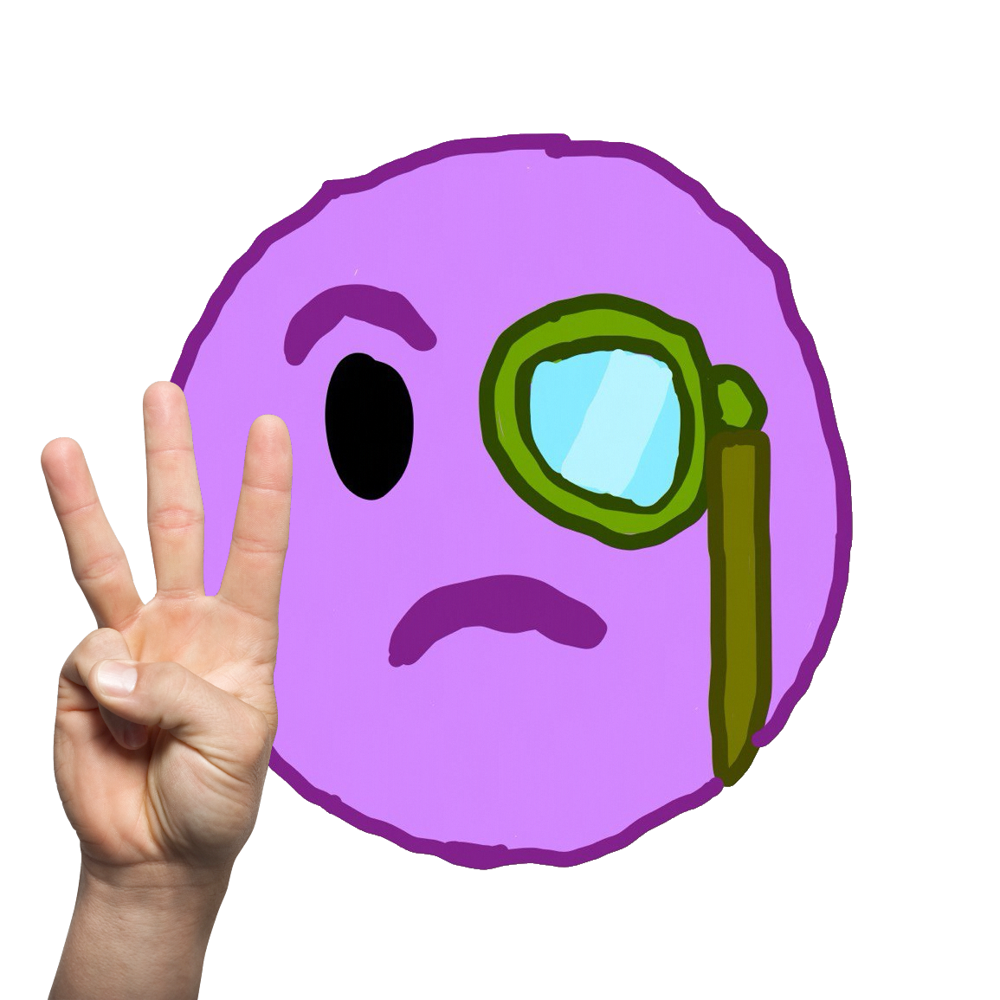
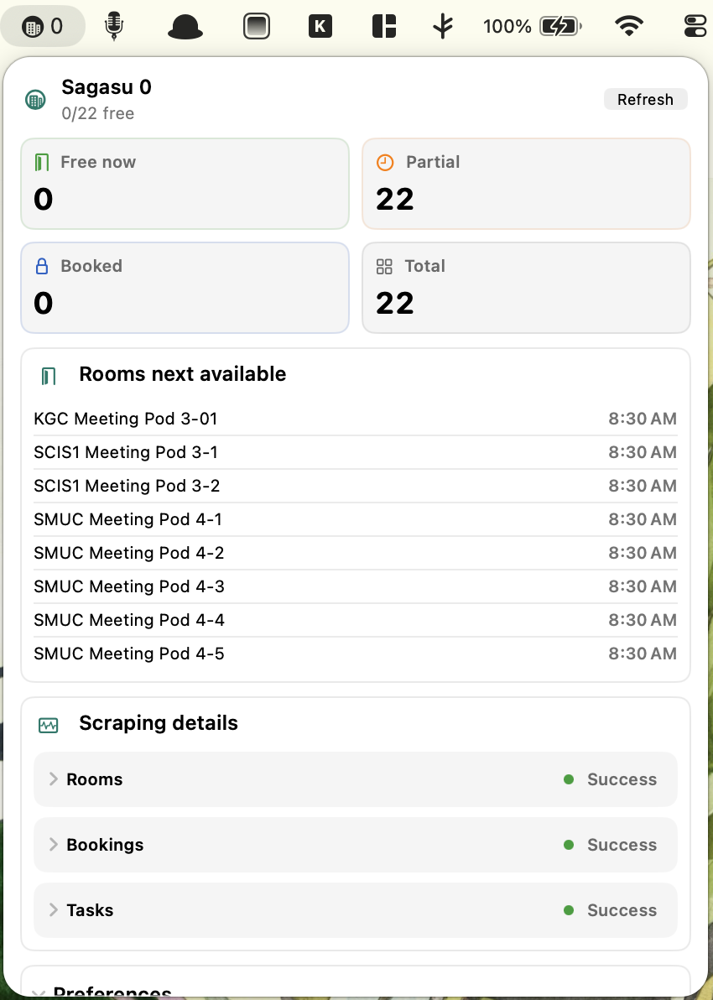
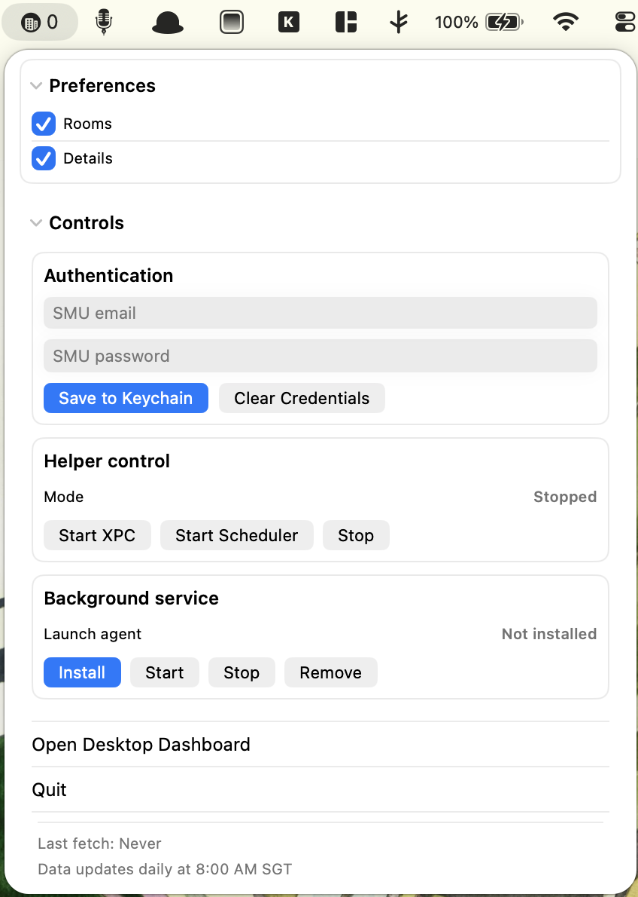
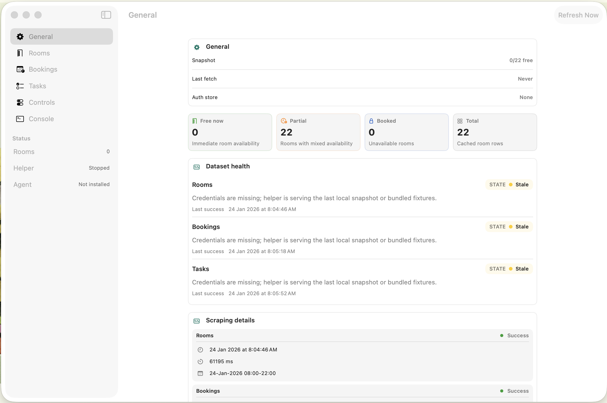
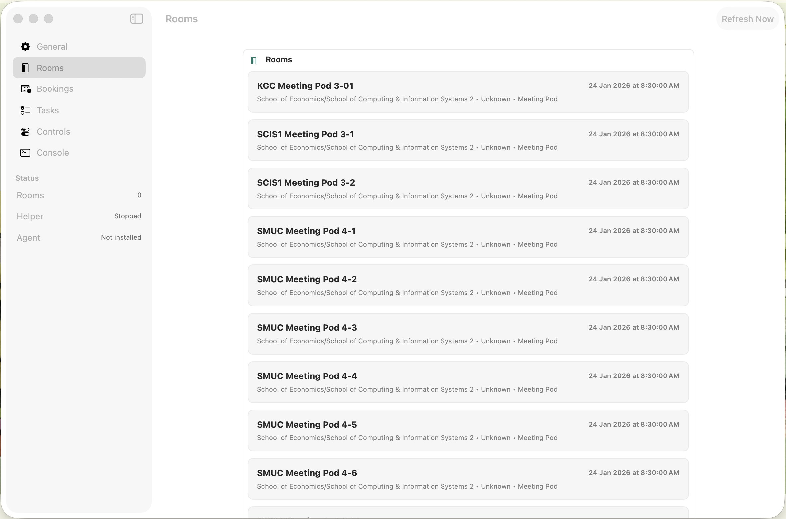
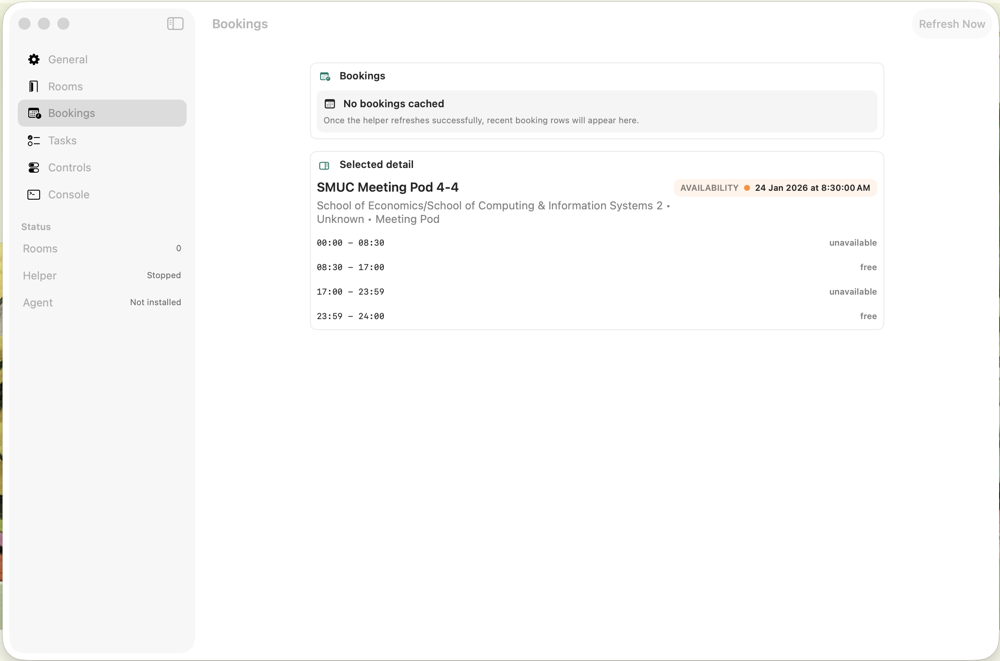
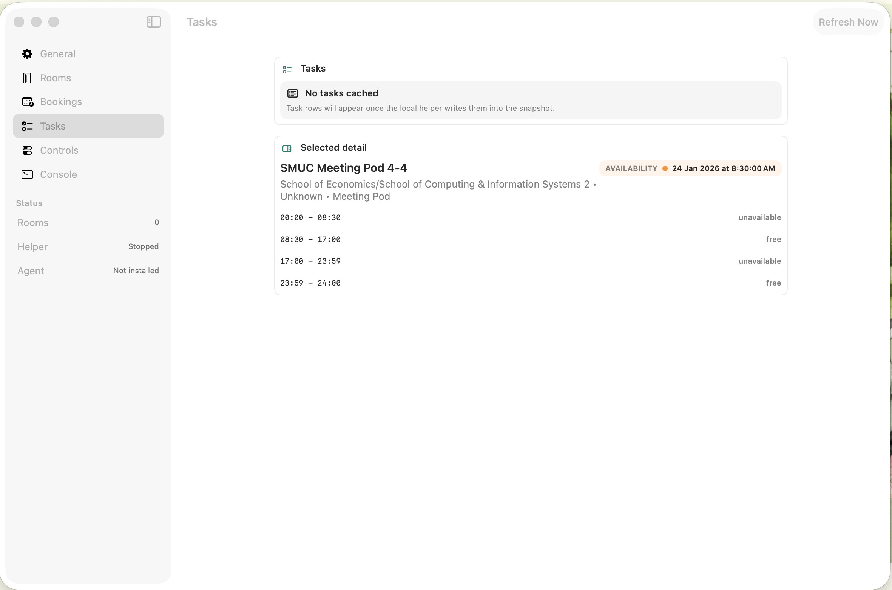
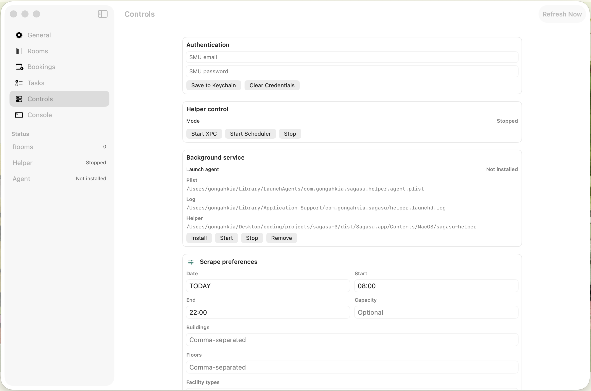
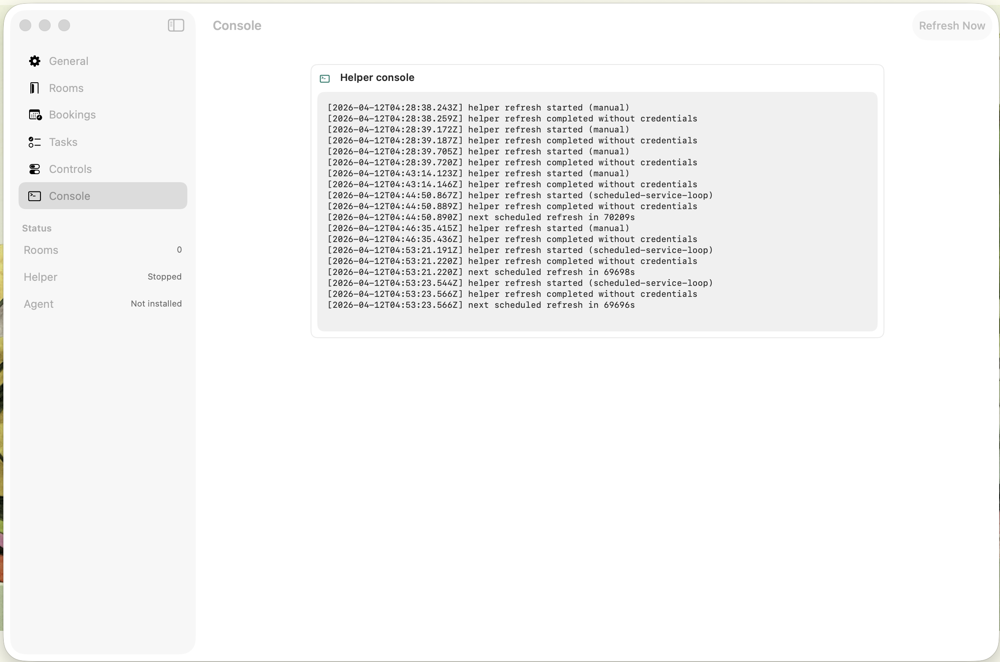
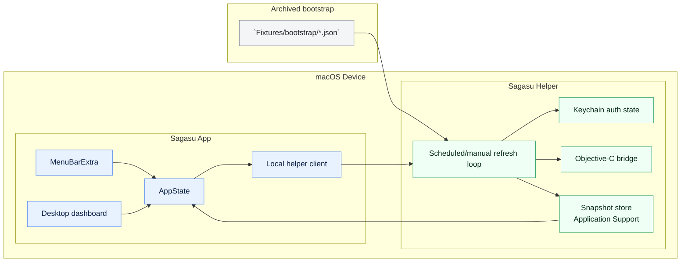

[](https://github.com/gongahkia/sagasu-3/releases/tag/3.0.0)
[](https://github.com/gongahkia/sagasu-3/releases/tag/3.1.0)


# `Sagasu 3`

<p align="center">
    
</p>

Run it back *(but as a MacOS menu bar & desktop app)*.

## Stack

* *Frontend*: [SwiftUI](https://developer.apple.com/swiftui/)
* *Backend*: [Swift](https://developer.apple.com/swift/), [Objective-C](https://developer.apple.com/documentation/objectivec)

## Rationale

See [this](https://github.com/gongahkia/sagasu#rationale), [this](https://github.com/gongahkia/sagasu-2#rationale), [this](https://github.com/gongahkia/sagasu-3#rationale) and [this](https://github.com/gongahkia/sagasu-4#rationale).

## Screenshots

### Menu Bar App

<div align="center">
    
    
</div>

### Desktop App

<div align="center">
    
    
    
</div>

<div align="center">
    
    
    
</div>

## Usage

The below instructions are for locally building and using `Sagasu 3`.

1. First execute the below to install the repository.

```console
$ git clone https://github.com/gongahkia/sagasu-3 && cd sagasu-3
```

2. Next install [XCode](https://apps.apple.com/us/app/xcode/id497799835?mt=12) from the Mac App Store.

3. Finally, run the below to build both the app and helper executables.

```console
$ ./scripts/build.sh
$ ./scripts/build_app_bundle.sh # optionally build the app bundle 
```

## Architecture


```mermaid
flowchart LR
  classDef app fill:#E8F2FF,stroke:#5B8DEF,stroke-width:1px,color:#0B1F44;
  classDef helper fill:#EFFFF5,stroke:#3AA76D,stroke-width:1px,color:#062A17;
  classDef data fill:#FFF6E5,stroke:#D49B3A,stroke-width:1px,color:#3B2103;
  classDef archive fill:#F4F5F7,stroke:#8A8F98,stroke-width:1px,color:#1F2328;

  subgraph mac[macOS Device]
    subgraph app[Sagasu App]
      MB[MenuBarExtra]
      DASH[Desktop dashboard]
      STATE[AppState]
      CLIENT[Local helper client]
      class MB,DASH,STATE,CLIENT app
    end

    subgraph helper[Sagasu Helper]
      LOOP[Scheduled/manual refresh loop]
      STORE[Snapshot store\nApplication Support]
      AUTH[Keychain auth state]
      BRIDGE[Objective-C bridge]
      class LOOP,STORE,AUTH,BRIDGE helper
    end
  end

  subgraph archive[Archived bootstrap]
    S4[`Fixtures/bootstrap/*.json`]
    class S4 archive
  end

  MB --> STATE
  DASH --> STATE
  STATE --> CLIENT
  CLIENT --> LOOP
  LOOP --> AUTH
  LOOP --> BRIDGE
  LOOP --> STORE
  S4 --> LOOP
  STORE --> STATE
```

## Nerd stuff

### Where is Sagasu 3 getting the data from?

`Sagasu 3`'s desktop app reads a locally cached `snapshot.json` from the user's Application Support directory.

### What is Sagasu 3's helper service doing?

`Sagasu 3`'s helper currently supports the following.

1. Manual refreshes via the app
2. Scheduled refresh loop support via `sagasu-helper service`
3. XPC service scaffolding via `sagasu-helper xpc-service`
4. Keychain-backed credential storage
5. `Sagasu 4` fixture bootstrapping when no live native browser run has been completed yet *(Archived)*

### Why are there 2 helpers?

`Sagasu 3` will prefer XPC when a helper service is available and falls back to launching the bundled helper executable directly when it is not.

## Other notes

`Sagasu 3` is where it is today because of the below projects. 

* [Sagasu](https://github.com/gongahkia/sagasu)
* [Sagasu 2](https://github.com/gongahkia/sagasu-2)
