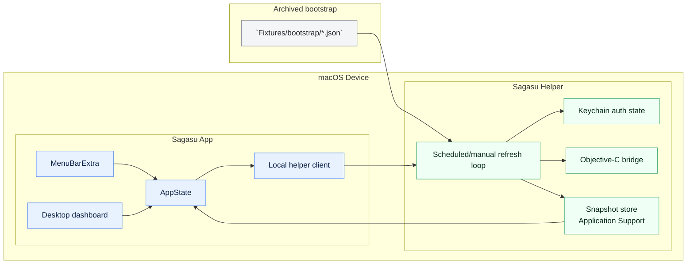
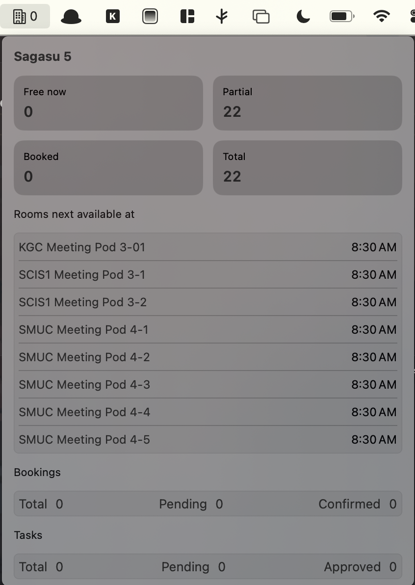
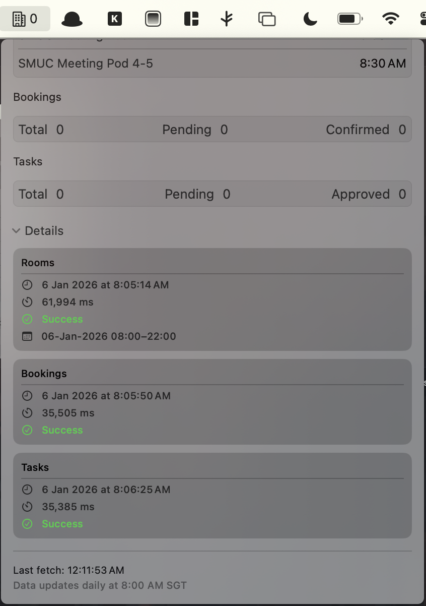
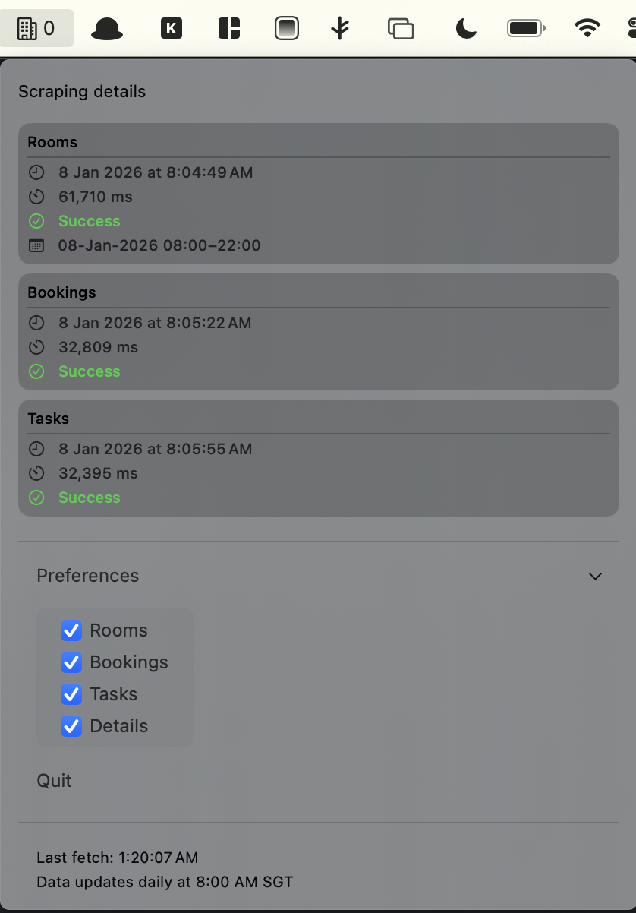

[](https://github.com/gongahkia/sagasu-5/releases/tag/5.0.0)


# `Sagasu 5`

<p align="center">
    
</p>

Run it back as a macOS menu bar app and desktop client.

## Stack

* *Desktop app*: [SwiftUI](https://developer.apple.com/swiftui/)
* *Helper service*: [Swift](https://developer.apple.com/swift/) + [Objective-C](https://developer.apple.com/documentation/objectivec)
* *Bootstrap data*: archived `Sagasu 4` scrape logs for local fixture seeding

## Rationale

See [this](https://github.com/gongahkia/sagasu#rationale), [this](https://github.com/gongahkia/sagasu-2#rationale), [this](https://github.com/gongahkia/sagasu-3#rationale) and [this](https://github.com/gongahkia/sagasu-4#rationale).

## Architecture


```mermaid
flowchart LR
  classDef app fill:#E8F2FF,stroke:#5B8DEF,stroke-width:1px,color:#0B1F44;
  classDef helper fill:#EFFFF5,stroke:#3AA76D,stroke-width:1px,color:#062A17;
  classDef data fill:#FFF6E5,stroke:#D49B3A,stroke-width:1px,color:#3B2103;
  classDef archive fill:#F4F5F7,stroke:#8A8F98,stroke-width:1px,color:#1F2328;

  subgraph mac[macOS Device]
    subgraph app[Sagasu App]
      MB[MenuBarExtra]
      DASH[Desktop dashboard]
      STATE[AppState]
      CLIENT[Local helper client]
      class MB,DASH,STATE,CLIENT app
    end

    subgraph helper[Sagasu Helper]
      LOOP[Scheduled/manual refresh loop]
      STORE[Snapshot store\nApplication Support]
      AUTH[Keychain auth state]
      BRIDGE[Objective-C bridge]
      class LOOP,STORE,AUTH,BRIDGE helper
    end
  end

  subgraph archive[Archived bootstrap]
    S4[`Fixtures/bootstrap/*.json`]
    class S4 archive
  end

  MB --> STATE
  DASH --> STATE
  STATE --> CLIENT
  CLIENT --> LOOP
  LOOP --> AUTH
  LOOP --> BRIDGE
  LOOP --> STORE
  S4 --> LOOP
  STORE --> STATE
```

## Screenshots

<div align="center">
    
    
    
</div>

## Usage

`Sagasu 5` is still primarily a personal-use project, but it now expects a local helper binary alongside the app instead of a remote GitHub JSON feed.

If you are interested in cloning and building `Sagasu 5` yourself, the below instructions are for you.

1. First execute the below to install the repository on your local machine.

```console
$ git clone https://github.com/gongahkia/sagasu-5 && cd sagasu-5
```

2. Next install Xcode from the [Mac App Store](https://apps.apple.com/us/app/xcode/id497799835?mt=12).

3. Build both the app and helper executables.

```console
$ ./scripts/build.sh
```

4. Build the app bundle if you want the helper copied into `Sagasu.app`.

```console
$ ./scripts/build_app_bundle.sh
```

5. Alternatively open the package directly within Xcode and build it there.

## Runtime Notes

The desktop app reads a locally cached `snapshot.json` from the user's Application Support directory.

The helper currently supports:

* manual refreshes via the app
* scheduled refresh loop support via `sagasu-helper service`
* user launch-agent install/start/stop/remove controls from the app
* XPC service scaffolding via `sagasu-helper xpc-service`
* Keychain-backed credential storage
* archived `Sagasu 4` fixture bootstrapping when no live native browser run has been completed yet
* retry-backed native WebKit scrapes with HTML and PNG diagnostics under Application Support

The app prefers XPC when a helper service is available and falls back to launching the bundled helper executable directly when it is not.

The Objective-C layer now owns the WebKit runtime boundary, synchronous page automation, and PNG snapshot capture. The Swift helper owns snapshot generation, retry logic, diagnostics persistence, status tracking, and the ported parsing logic.

## Data

`Sagasu 5` no longer fetches from `raw.githubusercontent.com` at runtime.

During development, the helper seeds its local cache from the bundled local fixture logs:

* `Fixtures/bootstrap/rooms.json`
* `Fixtures/bootstrap/bookings.json`
* `Fixtures/bootstrap/tasks.json`

Failed native scrape attempts also emit diagnostics under the app's Application Support directory in `diagnostics/`, including metadata, page HTML, and a PNG snapshot when WebKit can provide one.

## CI

GitHub Actions now validates the native rewrite on macOS:

* `.github/workflows/macos-ci.yml` builds both executables
* `.github/workflows/macos-ci.yml` runs `swift test`
* `.github/workflows/macos-ci.yml` builds the `.app` bundle

## Other notes

`Sagasu 5` is where it is today because of the below projects. 

* [Sagasu](https://github.com/gongahkia/sagasu)
* [Sagasu 2](https://github.com/gongahkia/sagasu-2)
* [Sagasu 3](https://github.com/gongahkia/sagasu-3)
* [Sagasu 4](https://github.com/gongahkia/sagasu-4)
